# Prodio ERD

모듈 간 JPA 연관관계 없음. ID 값 참조만 허용.

```mermaid
erDiagram

    %% ── catalog module ──────────────────────────────────
    catalog_clients {
        bigint      id              PK
        varchar     company_name    "회사명 (NOT NULL)"
        varchar     representative  "대표자"
        text        address         "주소"
        varchar     phone           "연락처 — SMS 발송에 사용"
        timestamptz created_at
        timestamptz updated_at
    }

    catalog_products {
        bigint      id          PK
        varchar     name        "품목명 (NOT NULL)"
        text        description "설명"
        bigint      unit_price  "단가(원) NOT NULL"
        timestamptz created_at
        timestamptz updated_at
    }

    %% ── order module ─────────────────────────────────────
    orders {
        bigint      id                      PK
        bigint      client_id               "catalog_clients.id 참조 (FK 없음)"
        varchar     client_name_snapshot    "수주 시점 회사명"
        varchar     client_phone_snapshot   "수주 시점 연락처 — SMS payload"
        bigint      product_id              "catalog_products.id 참조 (FK 없음)"
        varchar     product_name_snapshot   "수주 시점 품목명"
        bigint      unit_price_snapshot     "수주 시점 단가"
        int         quantity                "수량 NOT NULL"
        boolean     vat_included            "VAT 포함 여부 DEFAULT false"
        bigint      total_amount            "quantity x unit_price x (1.1 if vat)"
        date        due_date                "납기일 NOT NULL"
        text        delivery_address        "배송지"
        varchar     status                  "PENDING | IN_PRODUCTION"
        boolean     payment_confirmed       "입금 확인 DEFAULT false"
        bigint      created_by              "user_accounts.id 참조 (FK 없음)"
        text        note                    "메모"
        timestamptz created_at
        timestamptz updated_at
    }

    %% ── production module ────────────────────────────────
    production_records {
        bigint      id              PK
        bigint      order_id        "orders.id 참조 (FK 없음)"
        varchar     status          "IN_PRODUCTION | IN_DELIVERY | COMPLETED"
        timestamptz started_at      "생산 시작 시각"
        timestamptz shipped_at      "배송 시작 시각 (nullable)"
        timestamptz completed_at    "완료 시각 (nullable)"
        timestamptz created_at
        timestamptz updated_at
    }

    %% ── statistics module (Read Model) ──────────────────
    statistics_order_view {
        bigint      id                      PK
        bigint      order_id                UK  "orders.id 참조"
        bigint      client_id               "catalog_clients.id 참조"
        varchar     client_name             "스냅샷"
        bigint      product_id              "catalog_products.id 참조"
        varchar     product_name            "스냅샷"
        int         quantity
        bigint      total_amount
        date        due_date
        varchar     status                  "PENDING|IN_PRODUCTION|IN_DELIVERY|COMPLETED"
        boolean     payment_confirmed
        boolean     on_time                 "nullable — 완료 시 due_date 이행 여부"
        timestamptz order_created_at
        timestamptz production_started_at   "nullable"
        timestamptz shipped_at              "nullable"
        timestamptz completed_at            "nullable"
    }
```



## 상태 흐름

```
[Order]               PENDING ──→ IN_PRODUCTION
                                       ↓ OrderCreated 이벤트
[ProductionRecord]             IN_PRODUCTION ──→ IN_DELIVERY ──→ COMPLETED
                                                    ↓                ↓
                                              OrderShipped      OrderCompleted
                                            (SMS 자동발송)
```

## 모듈별 테이블 소유권

| 모듈 | 테이블 | 비고 |
|------|--------|------|
| `catalog` | `catalog_clients`, `catalog_products` | |
| `order` | `orders` | |
| `production` | `production_records` | |
| `statistics` | `statistics_order_view` | 이벤트 구독 → 갱신 |
| Spring Modulith | `event_publication` | 자동 생성 |

## 스냅샷 필드 이유

수주 등록 시점에 클라이언트명·연락처·품목명·단가를 `orders`에 복사한다.
이후 카탈로그 데이터가 수정되어도 수주 이력이 변하지 않는다.
또한 `OrderCreated` 이벤트 페이로드에 `client_phone_snapshot`을 포함시켜
production 모듈이 catalog DB를 직접 조회하지 않고 SMS를 발송할 수 있다.
